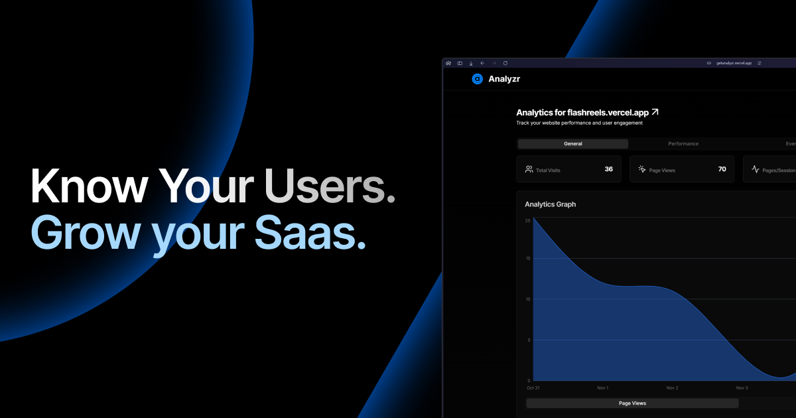
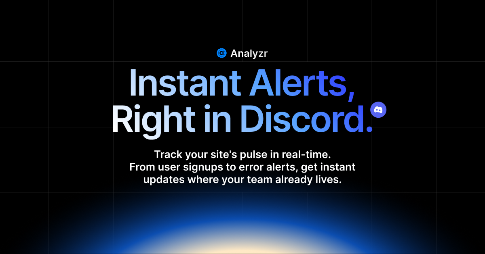

<div align="center">

# Analyzr 📊




</div>

---

### TL;DR 🚀
Analyzr is a free and open-source analytics tool that requires just one line of code to set up.

It comes with built-in Discord notifications and works seamlessly with any website, giving you all the analytics data you need to make informed decisions.

---

### 📑 Table of Contents
- [Why Did We Build This?](#-why-did-we-build-this)
- [Who Is This For?](#-who-is-this-for)
- [What Can It Do?](#-what-can-it-do)
- [How Does It Work?](#how-does-it-work)
- [Discord Integration](#-discord-integration)
- [What Makes It Different?](#-what-makes-it-different)
- [Want to Try It?](#-want-to-try-it)
- [Quick Links](#-quick-links)
- [Let's Chat!](#-lets-chat)
- [FAQ](#-frequently-asked-questions)

---

Hey there! 👋

Thanks for checking out Analyzr. It's a free tool that manages your website analytics and performance and offers many other features.

This project is an alternative to premium analytics services like Vercel Analytics.

With Analyzr, you can monitor everything from visitor activity to site performance without paying for it.

And the best part? It's **open-source** and **free for everyone**.

---

### 💡 Why Did We Build This?

Analyzr doesn't charge you for tracking custom events or monitoring performance, unlike other analytics tools.

You get all of this and more, totally free.

---

### 🎯 Who Is This For?


Developers who want to track their side projects.

Small business owners watching their website traffic.

Anyone who wants simple analytics without paying $$$.

---

### 🚀 What Can It Do?

Here are some of the core features of Analyzr:

- **Real-Time Tracking:** See what's happening on your website as it happens.

- **Custom Event Tracking:** Track specific actions your visitors take (for example, clicks on certain buttons).
  
  Here's how to track custom events:

  Using JavaScript/Node.js:
  ```javascript
  const axios = require('axios');
  
  const API_KEY = "YOUR_API_KEY";
  const url = "https://getanalyzr.vercel.app/api/events";
  const headers = {
      "Content-Type": "application/json",
      "Authorization": `Bearer ${API_KEY}`
  };
  
  const eventData = {
      name: "",        // required - event name
      domain: "",      // required - your website domain
      description: "", // required - event description
      emoji: "🔔",    // optional - emoji for Discord notification
      fields: [       // optional - additional fields for Discord notification
        {
          name: "Field Name",
          value: "Field Value", 
          inline: true // optional - display fields in same line
        }
      ]
  };
  
  const sendRequest = async () => {
      try {
        const response = await axios.post(url, eventData, { headers });
        console.log("Event sent successfully", response.data);
      } catch (error) {
        console.error("Error:", error.response ? error.response.data : error.message);
      }
  };
  
  sendRequest();
  ```

  Using Python:
  ```python
  import requests
  
  API_KEY = "YOUR_API_KEY"
  url = "https://getanalyzr.vercel.app/api/events"
  headers = {
      "Content-Type": "application/json",
      "Authorization": f"Bearer {API_KEY}"
  }
  
  event_data = {
      "name": "",        # required - event name
      "domain": "",      # required - your website domain
      "description": "", # required - event description
      "emoji": "🔔",    # optional - emoji for Discord notification
      "fields": [       # optional - additional fields for Discord notification
        {
          "name": "Field Name",
          "value": "Field Value",
          "inline": True # optional - display fields in same line
        }
      ]
  }
  
  def send_request():
      try:
          response = requests.post(url, json=event_data, headers=headers)
          response.raise_for_status()
          print("Event sent successfully", response.json())
      except requests.exceptions.RequestException as error:
          print("Error:", error)
  
  send_request()
  ```

  Yes, it's that simple!

- **Performance Monitoring:** Monitor how fast your site loads (and find areas to improve with smart suggestions on what to optimize next).

- **Device & Browser Stats:** See what devices, browsers, and operating systems your visitors are using.

- **Location Tracking:** Understand where your visitors are coming from.

- **Discord Notifications:** Get live updates on events right in your Discord DM.

---

### How Does It Work?


Here's exactly how Analyzr works, with no secrets:

First, you add our tracking script to your website - it's just a simple piece of code that counts when people visit your pages and what they click on.

This information goes straight to Supabase (our database provider), which organizes all this data.

We store everything safely in Supabase's storage system.

When you log in to your dashboard, you'll see all this information displayed in charts and numbers.

And if you want, we can send updates about your website straight to your Discord - it's that straightforward!

You can look at our code on GitHub to see exactly how everything works.

---

### 🤖 Discord Integration



Setting up Discord notifications is easy:

1. **Enable Developer Mode in Discord**
   - Open User Settings
   - Go to App Settings → Advanced
   - Enable Developer Mode

2. **Get Your Discord User ID**
   - Right-click your profile or username
   - Click "Copy User ID"

3. **Add it to Analyzr**
   - Go to /settings in your Analyzr dashboard
   - Paste your Discord User ID
   - Save the changes

Once set up, you'll get real-time notifications for:

- Website traffic spikes
- Performance alerts
- Custom event triggers
- Error notifications
- And more!

(as you set it.)

---

### 💪 What Makes It Different?


1. **It's Free**
   - No "free trial" tricks
   - No "upgrade to see more data" stuff
   - Just free, forever!

2. **Super Easy to Use**
   - Add one line of code to your site
   - See your stats right away

3. **Discord Integration**
   - Real-time notifications
   - Custom alerts for important events
   - Manage everything from Discord

---

### 📦 Want to Try It?

It's super easy to get started:

1. **Add the Tracking Script (and other stuff if needed)**
   
   For Vanilla/React apps:
   ```html
   <script
     defer
     data-domain="your-website.com"
     src="https://getanalyzr.vercel.app/tracking-script.js"
   >
   </script>
   ```

   For Next.js apps:
   ```html
   <Script
     defer
     data-domain="your-website.com"
     src="https://getanalyzr.vercel.app/tracking-script.js"
   />
   ```

   Just add this to your main layout or index file, and you're good to go!

2. Deploy your app to production.

3. It's done!

After you are done, start seeing real analytics on your dashboard.

---

### 🌟 Quick Links

- **Try it out:** [getanalyzr.vercel.app](https://getanalyzr.vercel.app)
- **Get the code:** [GitHub](https://github.com/arjuncodess/analyzr)
- **Launch:** [Product Hunt](https://www.producthunt.com/posts/getanalyzr)

---

### 💬 Let's Chat!

Got questions? Ideas? Just want to say hi.

- Drop an issue on GitHub
- DM me on Discord or X (@ArjunCodess)

We love hearing from users! 

---

### 🎉 Thanks!

Thanks for checking out Analyzr! We hope it makes your life a bit easier.

Happy tracking! 📊

P.S. If you like it, maybe give us a star on GitHub and an upvote on Product Hunt. ⭐

---

### ❓ Frequently Asked Questions

1. **Is Analyzr really free?**
   - Yes! We're 100% free and open source
   - No hidden fees or premium features
   - You can even self-host it if you want

2. **Will this slow down my website?**
   - Nope! Our tracking script is tiny (< 6KB)
   - It loads asynchronously (won't block your page)
   - Uses edge functions for super-fast response times

3. **Is my data private and secure?**
   - Absolutely! We use Supabase for secure data storage
   - Your data is never sold or shared
   - You can delete your data anytime
   - We don't track personal user information

4. **Can I use this with any website?**
   - Yes! Works with:
     - Next.js
     - React
     - Vue
     - Plain HTML
     - etc.

5. **What's the difference between Analyzr and other analytics tools?**
   - Free custom event tracking (others charge for this)
   - Built-in Discord notifications
   - No complex setup needed
   - Privacy-focused approach
   - Completely open source